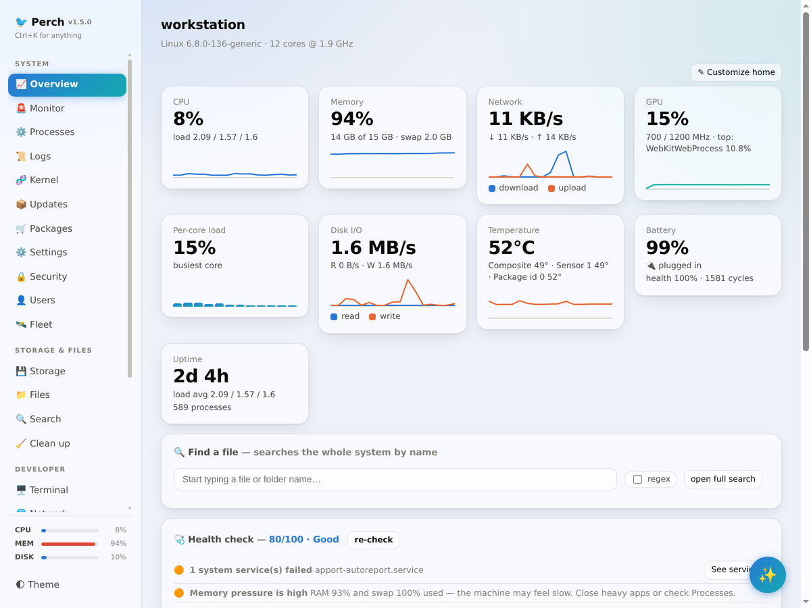
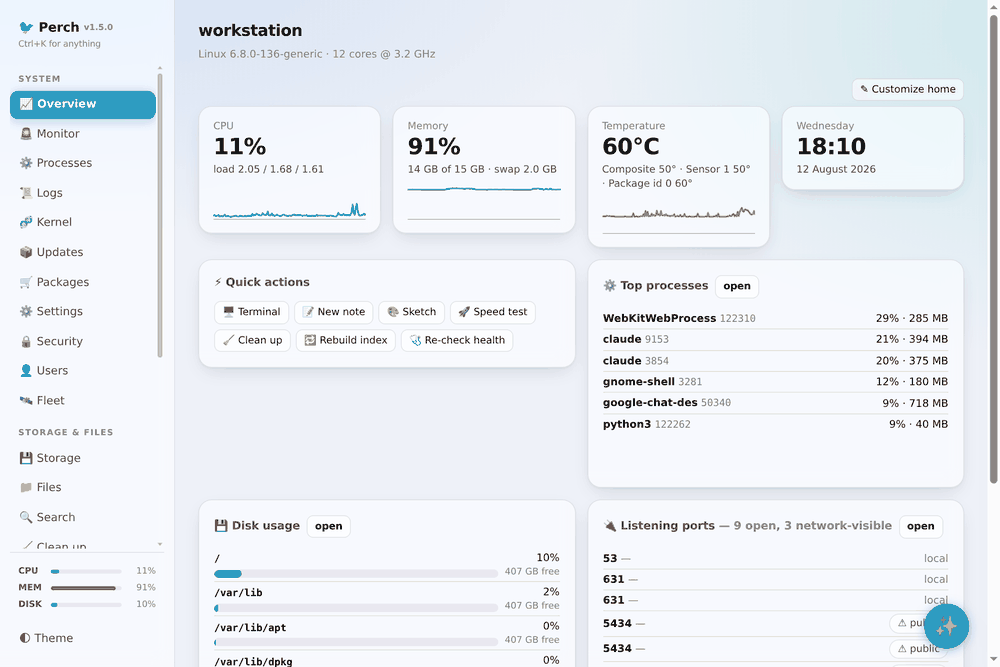
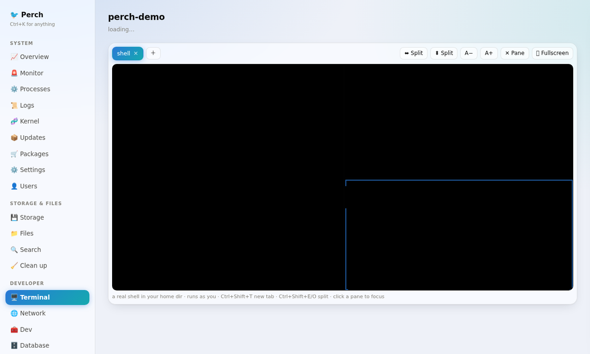

<div align="center">

# 🐦 Perch

**Your machine, at a glance.**

[](https://github.com/dwarka-prasad/perch/actions/workflows/ci.yml)


A local system + developer dashboard for Linux — monitoring, ops, a full
developer toolbox, and an AI assistant, in one token-protected web app that
runs on `127.0.0.1`.



</div>

---

## What is this?

Perch is a **self-hosted control panel for your own Linux machine**. It runs
as a small local web service and gives you a single browser tab (or a native
desktop window) where you can *see* everything that is happening on the
system and *act* on it — instead of juggling `htop`, `df`, `du`, `systemctl`,
`journalctl`, `lsof`, `docker ps`, Postman, and a pile of scratch converter
tabs.

It is built for:

- **Daily laptop/workstation care** — watch CPU, memory, temperature and
  battery health, get alerts when something crosses a threshold, clean up
  caches, and manage packages and settings without opening five terminals.
- **Developers** — manage Docker containers, systemd services, listening
  ports, git repos, and API requests from one place, with a built-in toolbox
  for the everyday small jobs (JSON, regex, diff, cron, secrets…).
- **Privacy-minded users** — everything runs locally as *you*. It binds to
  `127.0.0.1`, requires an access token, and never sends data anywhere.

Under the hood it is a single small Python service (stdlib HTTP server +
`psutil`) with a framework-free HTML/CSS/JS frontend — no database, no build
step, no cloud.

## What can you do with it?

### Monitor the system
- **Overview** — live charts for CPU, memory, GPU, disk I/O, temperatures and
  network, plus a hardware panel (model/BIOS, battery health & cycles, Wi-Fi
  signal), a critical-log panel, and a **health scorecard** (score out of 100
  with plain-language findings and one-click fixes). The home screen is
  customizable with drag-to-reorder widgets.
- **Monitor** — threshold alerts (CPU/mem/disk/temp…) with desktop
  notifications and outbound channels (ntfy, Slack, Discord, generic
  webhook), log-pattern watchers, and 24 h of one-minute history.
- **Processes / Users / Logs / Kernel / Updates** — kill processes, inspect
  any process in a detail modal, browse the journal live, read kernel
  tunables, and see pending APT updates with a sidebar badge.



### Manage storage & files
- **Storage** — disk usage plus a folder-size analyzer to find what's eating
  space, and a **backup helper** (rsync folders to another drive, on demand or
  a daily/weekly schedule); a **Clean up** tab for caches and trash with an
  optional weekly auto tidy-up.
- **Files** — a full file browser with previews (images, PDF, video, audio,
  Word, Excel), open-with, bulk trash, set-as-wallpaper, and a side drawer
  containing a text editor (with vim mode) and a sketch canvas.
- **Search** — whole-system filename search with regex support, backed by
  Perch's own index (no `locate` needed).

### Developer tools
- **Terminal** — a real shell in the browser (a proper pty, not a command box),
  running as you in your home directory. A kitty-style multiplexer: multiple
  session tabs, drag-resizable splits (side-by-side or stacked), fullscreen,
  and font zoom, with keyboard shortcuts (Ctrl+Shift+T/E/O/W/±).

  
- **Network** — listening ports with kill-by-port, public IP, and a speed
  test.
- **Dev** — Docker containers with live stats, logs, shell, compose control
  and prune; systemd user services; toolchain overview.
- **Database** — browse SQLite files and PostgreSQL (host `psql` or a running
  container), read-only by default with opt-in writes.
- **Git** — a dashboard of your repos: branch, dirty state, ahead/behind, with
  fetch/pull/stash, and a **project launcher** that runs the repo's own
  npm/yarn/pnpm scripts or Make targets as live jobs.
- **API client** — a mini-Postman: collections, environments with
  `{{variables}}`, request history, multi-step **flows** you can run and
  export, and import from Postman collections, curl commands, or raw HTTP.
- **Runtimes** — detect installed language runtimes, switch defaults (rustup,
  `update-alternatives`), and manage **SSH keys** (list, fingerprint, copy
  public key, generate ed25519).
- **Tools** — JSON format/sort/extract, YAML ↔ JSON, base64/URL/epoch/UUID/
  JWT/SHA-256 converters, regex tester, text diff, cron explainer, color and
  case converters, secret generator, website screenshot preview, and a
  **scheduled-tasks manager** (edit crontab, enable/disable systemd timers).

### AI assistant
- Chat about your machine with a live system snapshot injected, and generate
  a one-click **health report**. The provider is pluggable: the local Claude
  CLI (default, no API key), the Anthropic API, any OpenAI-compatible
  endpoint, or a local Ollama model — configured in Settings.

### Control the desktop
- **Settings** — brightness, volume, power profile, blank/suspend timers,
  night light, Do Not Disturb, Bluetooth, Wi-Fi, GNOME theme, wallpaper (and
  a live wallpaper slideshow), plus dashboard theming: accent colours and
  animated backgrounds.
- **Tweaks** — GNOME Tweaks-style controls: GTK / icon / cursor themes,
  interface/monospace/document fonts with antialiasing & hinting, titlebar
  buttons, clock format, animations, hot corner, workspaces, and mouse /
  touchpad pointer speed.
- **Dashboard theme** — accent colour, animated backgrounds, a **Simple mode**
  toggle (hide developer tabs), and a **Reduce effects** toggle that turns off
  blur, the gradient backdrop, glows and animations for low-powered machines.
- **Packages** — search, install, remove and upgrade across your native
  package manager (**apt, dnf, pacman or zypper**, auto-detected) plus **snap**
  and **flatpak** when present. A system password dialog (`pkexec`) appears for
  privileged actions.

Everything is reachable through a **Ctrl+K command palette**, and the grouped
sidebar shows live CPU/MEM/DISK mini-bars. Integrations that aren't installed
on your machine hide themselves automatically — and a **Simple mode** toggle
(in Settings) hides the developer tabs entirely for a monitoring-and-settings
dashboard aimed at non-technical users.

## Installation

### Requirements

- Linux — package management works on apt/dnf/pacman/zypper; the Settings and
  Tweaks tabs assume GNOME and hide themselves elsewhere
- **Required:** Python ≥ 3.8, `psutil`, `PyYAML` (`psutil` auto-installs on
  first run if missing)
- **Optional:** `python-docx` + `openpyxl` (Word/Excel preview), PyGObject +
  WebKit2GTK (native window), Chrome/Chromium (website preview), Docker,
  the `claude` CLI or an LLM API key (AI tab)

### Option 1 — Debian / Ubuntu package (recommended)

```bash
git clone https://github.com/dwarka-prasad/perch && cd perch
make deb                                  # builds dist/perch_1.2.2_all.deb
sudo apt install ./dist/perch_1.2.2_all.deb
```

Then launch **Perch** from your app menu, or:

```bash
perch-desktop     # native window
perch             # headless — open the printed URL in a browser
```

### Option 2 — From source, per-user (no root)

```bash
git clone https://github.com/dwarka-prasad/perch && cd perch
make install-user
```

This sets up a systemd **user** service (`perch.service`) plus an app-menu
launcher — no pip, no root. Useful commands afterwards:

```bash
systemctl --user status perch     # is it running?
systemctl --user restart perch    # restart after editing the code
make uninstall-user               # remove service + launcher
```

### Option 3 — Docker (headless host monitoring)

```bash
git clone https://github.com/dwarka-prasad/perch && cd perch
docker compose -f docker/compose.yaml up -d --build
docker compose -f docker/compose.yaml logs    # copy the token URL
```

> The container runs with host PID + network namespaces for real visibility.
> Desktop-only features (brightness, wallpaper, Bluetooth, notifications,
> opening apps) work only in the native/`.deb` install on the host.

### Just run it (no install)

```bash
make run          # http://127.0.0.1:9080  (token printed at startup)
make desktop      # native GTK/WebKit window
```

### First run

On first start Perch generates an access token in `~/.perch-token` and prints
a ready-to-open URL like `http://127.0.0.1:9080/?t=<token>`. Every request
needs that token — bookmark the URL.

## Configuration

| Env | Default | Meaning |
|-----|---------|---------|
| `PERCH_PORT` | `9080` | Port to bind |
| `PERCH_HOST` | `127.0.0.1` | Bind address (`0.0.0.0` to reach from LAN — still token-protected) |

State (search index, alert history, screenshots) lives under
`~/.cache/perch`; alert and app config under `~/.config/perch`.

## Security

Perch binds to `127.0.0.1` and every request needs the token from
`~/.perch-token`. On first visit the URL token is exchanged for an
`HttpOnly`, `SameSite=Strict` cookie and the URL is cleaned, so the token
stops living in browser history; repeated bad tokens from one address are
locked out. Privileged actions (package install, upgrades) go through
`pkexec`, which shows a system password dialog — credentials are never stored
or handled by Perch. The web terminal and database browser run as your user;
writes from the file editor/sketch are restricted to your home directory.
Review the code before exposing it beyond localhost.

## Development

See [CONTRIBUTING.md](CONTRIBUTING.md). Backend is one organised module;
frontend is plain HTML/CSS/JS with no build step. `make help` lists tasks.
Run the tests with:

```bash
python3 -m unittest discover -s tests -v
```

## Releasing

CI (`.github/workflows/ci.yml`) lints, compiles, and builds the `.deb` and
Docker image on every push/PR. To cut a release, bump the version in
`packaging/debian/control` + `pyproject.toml`, then:

```bash
git tag v1.0.0 && git push origin v1.0.0
```

`release.yml` then builds the `.deb`, pushes the image to
`ghcr.io/<owner>/perch`, and publishes a GitHub Release with the `.deb`
attached.

## License

MIT — see [LICENSE](LICENSE).
